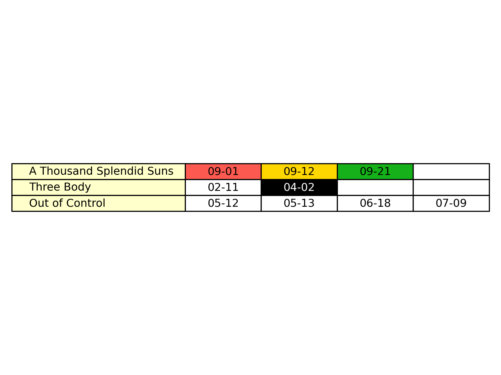

# Retrospective Planner

| [中文版](README-zh.md) |
| - |

This is a tool for converting retrospective plans from `.csv` to `.png`.

## Content

- [Background](#background)

    - [Retrospective Planning](#retrospective-planning)
    - [CSV](#csv)
    - [JSON](#json)
    - [Regular Expression](#regular-expression)

- [Prerequisites](#prerequisites)

- [Usage](#usage)

    - [Making A CSV File](#making-a-csv-file)
    - [CSV Basics](#csv-basics)
    - [CSV To PNG](#csv-to-png)
    - [Configuration](#configuration)
    - [Themes](#themes)

- [Examples](#examples)

## Background

### Retrospective Planning

[Retrospective planning](https://www.youtube.com/watch?v=b7o09a7t4RA) is the opposite way of prospective planning.
In prospective planning, future events are pre-defined according to timeline and final goals.
The tasks are pretty organized and managed, users can clearly see their next step.
This planner is useful in daily routines.

However, this method comes with several disadvantages:

- unclear progress

    Targets, especially academic goals, are not accomplished at once.
    Effectiveness of learning/working sessions are different from one another.
    While tasks are organized by timeline, progress isn't clearly shown.

- low flexibility
    
    As tasks are fixed on the timeline, it's difficult to make changes to specific items without interfering others.

- hard to facilitate

    Just like all strict but not enforced measures.

Here the **retrospective planning** comes.
The word `retrospective` means 'looking back', which in this approach, future actions depend on achievements in the past, rather than timeline.

Goals, or subjects in terms of learning, are listed at start of a table.
Whenever you work on that goal by trying to complete certain tasks, for example, doing practice questions to learn trigonometry, date/time and outcome is recorded in a following cell.
Cycling through the subject list as a routine, progress of each subject is clearly displayed by outcome shown in the latest cell.

Here is an example:

| trigonometry | 09-08 (bad) | 09-12 (ok) | 09-16 (good) | 09-20 (deadline) |
| - | - | - | - | - |

1. An user was to prepare for a trigonometry test on `09-20`, a `deadline` cell was put at the end.
2. The first time the user was studying trigonometry, he did 10 practice questions but only got 2 correct, so outcome of the learning session on `09-08` was labeled as `bad`.
3. 4 days later, he saw that `trigonometry` was `bad`, hence studied trigonometry again and got 5 out of 10 questions correct, so he gave himself a label `ok`.
4. Then, he put more effort in that subject, obtained a better score, 8/10 which was `good`.
5. Now, he is pretty confident with the test.

Usually, crafting of these kind of tables is done by Excel-like applications.
In Excel, cells can be colored at will.

As some people (I) would like to do it in a simple, extendable way without help from any office suite, here we have a python script for `csv` lovers.

### CSV

CSV stands for **C**omma-**S**eparated **V**alues.
Texts between commas are treated as a value, or a `cell` like what you see in Excel.

Writing in `csv` files is very simple, take a look at the following example:

```csv
trigonometry,1a,2b,3c
complex number,i,e,theta
```

That's it, comma-separated values!

### JSON

[JSON](https://www.w3schools.com/whatis/whatis_json.asp) stands for **J**ava**S**cript **O**bject **N**otation.
It is a file format which its content should be easy to understand.

This script uses JSON as the format of its configuration and theme files.

**Note that JSON has a strict grammar, be careful while editing it.**

### Regular Expression

[Regular expression (regex)](https://en.wikipedia.org/wiki/Regular_expression) is a powerful tool for 'find and/or replace' tasks.

This script uses regex for matching input and theme files.

**Note that regex has a strict grammar, be careful while editing it.**

## Prerequisites

- [python](https://www.python.org) (tested on latest stable version)

    Python is a programming language, which this tool is written in.
    To install python, download the latest release from [its website](https://www.python.org/downloads/) and follow its instructions.
    Alternatively, you can install it through your preferred package manager:

    - macOS

        `brew install python`
        (requires [homebrew](https://brew.sh))
    
    - Windows

        `winget install -e --id Python.Python.3.11 --scope machine`
    
    - Linux

        Use respective package manager.

- [matplotlib](https://matplotlib.org)

    This is a package for plotting in python.
    To install, run

    `pip install matplotlib`

## Usage

### Making A CSV File

Create a new `.csv` file in your way.
Maybe call it `plans.csv`?

Then let's open it with your favorite text editor, can be Notepad, TextEdit, VS Code, Vim or anything that can edit text!

### CSV Basics

1. write names of subjects in the first column as a list of cells

    ```csv
    trigonometry
    complex number
    ```

    Optionally, you can set deadlines for subjects by adding cells tagged as `#dead` at the end of subject lines:
    ```csv
    trigonometry,11-01#dead
    complex number,11-21#dead
    ```

2. as you work on a subject, add a `date` cell after that subject

    ```csv
    trigonometry,09-08
    complex number,09-01
    ```

    **Note that a subject without any following cell will be ignored in conversion.**

3. base on the working/learning outcome, tag the `date` cell as `#good`, `#ok` or `#bad`

    ```csv
    trigonometry,09-08#bad
    complex number,09-01#ok
    ```

    For now, **only the first tag per cell is used**.
    Undefined tags will also be ignored.

### CSV to PNG

After writing your plans in a `.csv` file, you may want to export it as a colored picture for better readability and convenience.

In this case, [this script](csv2png.py) is needed for the conversion.
Download it to your computer.

1. place the `.csv` file and the `csv2png.py` script in the same folder, in this tutorial it's `the_folder`

    ```
    the_folder/
    |--- plans.csv
    |--- csv2png.py
    ```

2. open your terminal emulator (bash, cmd, pwsh, zsh...), `cd` to `the_folder`

    ```sh
    cd path/to/the_folder
    ```

3. run the script

    ```sh
    python csv2png.py
    ```

4. follow prompted instructions

    1. key in name of the `.csv` file without `.csv`

        ```
        plans (press Enter)
        ```
    
    2. wait till conversion is complete

        You will see logs prompted to the terminal.

    3. there should be a `.png` file with the same name as your `.csv` file

        ```
        the_folder/
        |--- csv2png.py
        |--- plans.csv
        |--- plans.png
        ```

	

### Configuration

The script allows you to configure how the input file(s) and the output file(s) are located, as well as path to the theme file and which theme to use.

To customize themes, see section [themes](#themes).

#### Making A Config File

1. create a JSON file named as `retro.conf.json`
2. place it in the same folder as the script

#### Adding Config Items

```json
{
    "input_path": "./in/plan.*",
    "output_dir": "./out/",
    "theme_path": "./themes/fun.*",
    "theme_name": "funky"
}
```

##### `input_path`
`input_path` is path to the input file(s).
With this item set to a proper value, typing filename is not needed while running the script.

Its default value is an empty string, which you have to specify.

**Note that the filename section of this path is treated as a [regular expression](https://regexr.com) pattern, and does not need to match the `.csv` suffix.**

For example, `./in/plan.*` will match every `.csv` file in `./in/` which its name starts with `plan`.

##### `output_dir`
`output_dir` decides the directory/folder which pictures will be output to.
If its set to `./out/`, output pictures will be placed in `./out/`.

Its default value is `./`.

**Note that the script does not generate non-existing paths, so make sure the directory actually exists.**

##### `theme_path`
`theme_path` means path to the theme file(s).
If the path does not exist, the default theme will be used.

**Note that the filename section of this path is treated as a [regular expression](https://regexr.com) pattern, and does not need the `.json` suffix.**

For example, `./themes/fun.*` will match every `.json` file in `./themes/` which its name starts with `fun`.

Its default value is an empty string, which you have to specify.

##### `theme_name`
`theme_name` is name of the theme that will be used in picture generation.
If the theme does not exist or the theme name is not set, the default theme will be used.

Its default value is an empty string, which represents no theme chosen.

### Themes

Themes define colors (possibly more in the future) of cells and texts in the output pictures.

#### Making A Theme File

1. create a `.json` file
2. place it at [`theme_path`](#theme_path)

#### Adding A Theme

```json
{
	"funky": {
		"fore": "#E6DAA6",
		"back": "#808080",
		"edge": "#929591",
		"subject": {
			"back": "#01153E"
		},
		"tags": {
			"good": {
				"back": "#029386"
			},
			"ok": {
				"back": "#A9561E"
			},
			"bad": {
				"back": "#EF4026"
			},
			"dead": {
				"fore": "#3D1C02",
				"back": "#E6DAA6"
			},
			"hey": {
				"back": "white",
				"fore": "black"
			}
		}
	}
}
```

At the first level, name of the theme is stated (`funky`).

It has three main elements, `fore` for foreground (texts) color, `back` for background color and `edge` for edge line color of the cells.

Other than the main elements, there are optional elements `subject` and `tags`.

`subject` is and is only for the first column.

`tags` contains tags that can be used in the `.csv` files by appending `#tag_name` into a cell.

Each optional elements can have `fore`, `back` or `edge` set.
**Main colors will be used if they are not specified for optional elements.**

**Basic color names (white, black, red, blue, etc.) and hex color code are supported.**

#### Adding A Tag

As you may have noticed, there is a `hey` tag in the theme code above.
`hey` is not a built-in tag, but with this theme it works as expected, changing text color to black and background color to white.

That simple!
To add a tag, you only need a new element under `tags` in the theme.

## Examples

- [example configuration](retro.conf.json)
- [example CSV](example-plan.csv)
- [example custom theme](example-theme.json)
- [example PNG](example-plan.csv)
- example shell outputs
    
    ```
    tools/retro-planner% python csv2png.py
    [Info] Reading the theme file example-theme.json...
    [Info] Using "funky" in example-theme.json...
    [Info] Reading example-plan.csv...
    [Info] Converting example-plan.csv...
    [Info] Saving example-plan.csv into a picture...
    [Info] Finished conversion, output to ./.
    ```

    ```
    tools/retro-planner% python csv2png.py
    [Warning] Configuration file retro.conf.json not found, using the default configuration...
    To use a custom configuration, put "retro.conf.json" in the same directory as this script.

    Enter name/regex of the .csv file(s) without ".csv": example-.*
    [Info] No theme specified, using the default theme...
    [Info] Reading example-plan.csv...
    [Info] Converting example-plan.csv...
    [Info] Saving example-plan.csv into a picture...
    [Info] Finished conversion, output to ./.
    ```

    ```
    tools/retro-planner% python csv2png.py
    [Error] Output directory ./out does not exist!
    ```

    ```
    tools/retro-planner% python csv2png.py
    [Info] Reading the theme file example-theme.json...
    [Warning] Theme "mr.nothing" not found! Falling back to default theme...
    [Info] Reading example-plan.csv...
    [Info] Converting example-plan.csv...
    [Info] Saving example-plan.csv into a picture...
    [Info] Finished conversion, output to ./.
    ```
